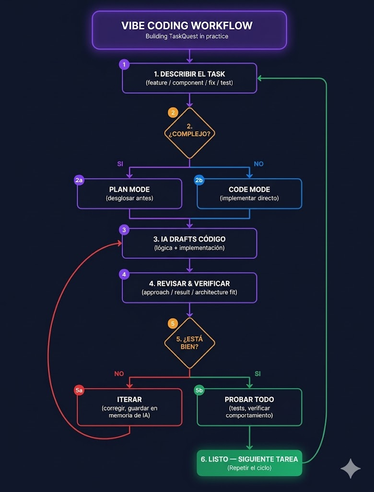

# Vibe Coding Workflow: Construyendo tu SaaS de Coworking

## El Ciclo Visual

---

## Explicación Simple Paso a Paso

### 1. Describir la Tarea
**Qué haces:** Le decís a la IA qué querés construir.

**Ejemplo para tu proyecto:**
> "Necesito que los miembros de un coworking puedan ver un calendario con los espacios disponibles y reservar uno en 2 clics. Los datos deben persistir en una base de datos."

**Consejo:** Sé específico. Mencioná qué pantalla, qué usuario, qué resultado esperás.

---

### 2. ¿Es Complejo?
**Qué haces:** Decidís si la tarea necesita planificación o podés ir directo al código.

| Si es COMPLEJO | Si es SIMPLE |
|----------------|--------------|
| - Autenticación multitenant | - Agregar un campo al formulario |
| - Integración con pasarela de pagos | - Cambiar color de un botón |
| - Migración de base de datos | - Mostrar texto dinámico |
| - Flujo con múltiples roles (admin/miembro) | - Arreglar un error de visualización |

**Plan Mode:** La IA te ayuda a desglosar la tarea en pasos más pequeños antes de escribir código.

**Code Mode:** La IA escribe el código directamente.

---

### 3. IA Drafts Código
**Qué haces:** La IA genera el código (lógica + implementación).

**Qué pasa:** Aparecen pantallas, componentes, funciones. Es el momento mágico del "vibe".

**Ejemplo:** Le pedís "crear el dashboard del admin" y la IA te genera una pantalla con tabla de miembros, ingresos del mes y reservas activas.

---

### 4. Revisar
**Qué haces:** Mirás lo que generó la IA. Preguntate:

- ¿El enfoque es correcto?
- ¿Esto resuelve lo que pedí?
- ¿Encaja con lo que ya tengo construido?

**Consejo:** No aceptes todo ciegamente. El "vibe" no es dejar que la IA decida todo. Sos vos quien dirige.

---

### 5. ¿Está Bien? — Decisión
**Qué haces:** Evaluás el resultado.

| Si NO está bien | Si SÍ está bien |
|-----------------|-----------------|
| Le pedís a la IA que corrija | Pasás a probar |
| Guardás la corrección en "memoria" para que aprenda | Ejecutás tests |
| Volvés al paso 3 | Verificás comportamiento real |

**Ejemplo de iteración:**
> "El calendario se ve bien, pero no está mostrando los horarios ocupados. Corregilo para que muestre en rojo los horarios ya reservados."

---

### 6. Listo — Siguiente Tarea
**Qué haces:** Confirmás que la funcionalidad funciona y pasás a la siguiente tarea.

**El ciclo se repite:** Cada tarea pequeña sigue el mismo flujo. Así construís tu SaaS pieza por pieza.

---

## Aplicado a tu SaaS de Coworking

Aquí hay un ejemplo concreto de cómo aplicarías este ciclo:

| Paso | Qué harías |
|------|------------|
| **1. Describir** | "Crear la página de login para que cada coworking tenga su propia URL: `espacio-mia.coworkhub.com/login`" |
| **2. ¿Complejo?** | SÍ (multitenant + autenticación) → **Plan Mode** |
| **3. IA Drafts** | La IA genera: código de Supabase, rutas dinámicas, componentes de login |
| **4. Revisar** | Verificás que los usuarios de un coworking no puedan loguearse en otro |
| **5. ¿Está bien?** | No: un usuario logueado ve datos de otro coworking → **Iterás**: "Corregí el aislamiento de datos" |
| **6. Listo** | Funciona. Pasás a la siguiente tarea: "Crear el calendario de reservas" |

---

## Reglas de Oro para tus Alumnos

| Regla | Por qué |
|-------|---------|
| **Una tarea a la vez** | Si pedís 5 cosas juntas, es difícil revisar y corregir |
| **Guardá correcciones en memoria** | Cada vez que la IA se equivoca, decile "recordá esto para la próxima" |
| **Probá después de cada tarea** | No acumules errores. Validá que funcione antes de seguir |
| **El Plan Mode no es opcional para tareas complejas** | Saltarse la planificación = código desorganizado que después no podés mantener |
| **El código es tuyo, la IA solo escribe** | Revisá, entendé, hacé preguntas. El "vibe" es colaboración, no delegación |

---

## *Challenge para la Clase*

**Consigna:** Aplicá el ciclo de Vibe Coding a una tarea concreta de tu SaaS de coworking.

1. **Describí** una tarea (ej: "Que el admin pueda agregar un nuevo espacio de coworking con nombre, capacidad y foto")
2. **Decidí** si es compleja o simple
3. **Ejecutá** con IA (Bolt.new, Lovable, etc.)
4. **Revisá** el resultado
5. **Iterá** al menos una vez
6. **Mostrá** el resultado final funcionando
